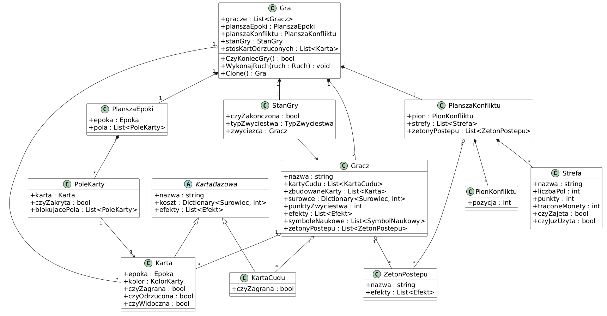
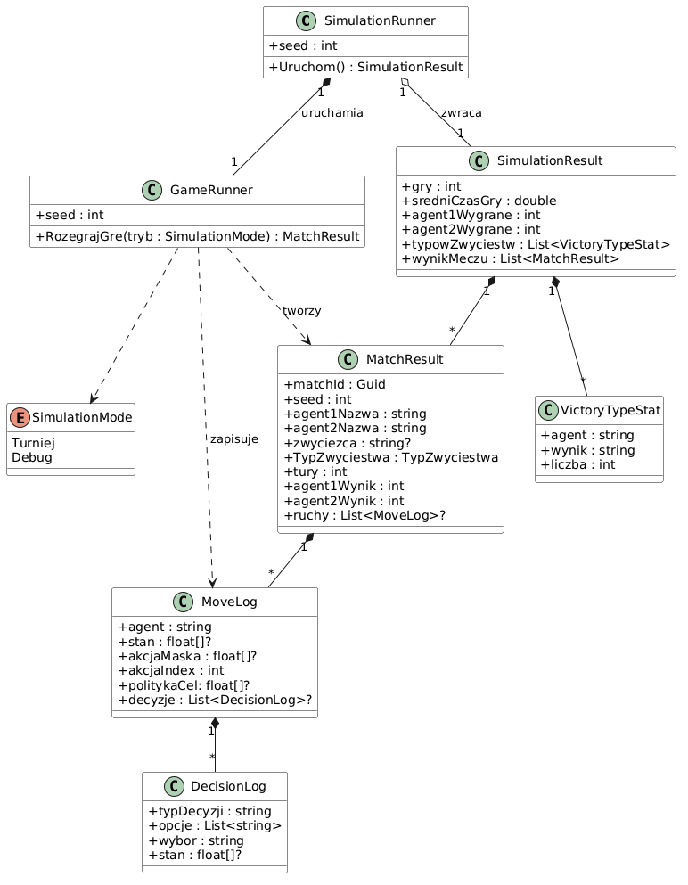
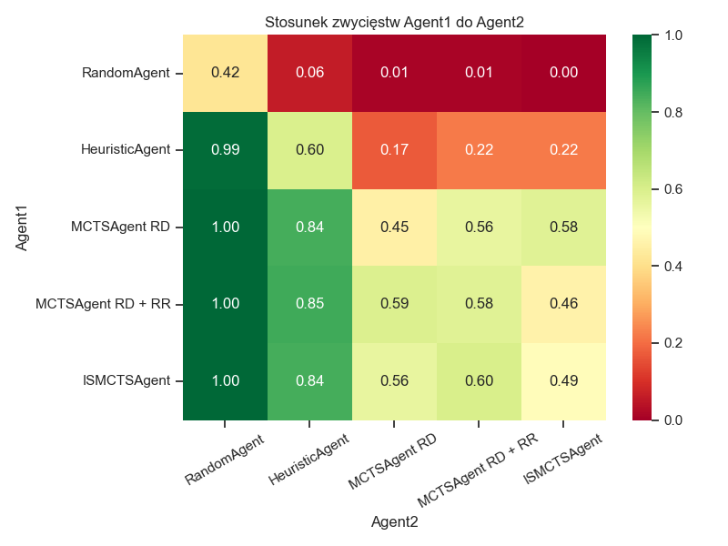
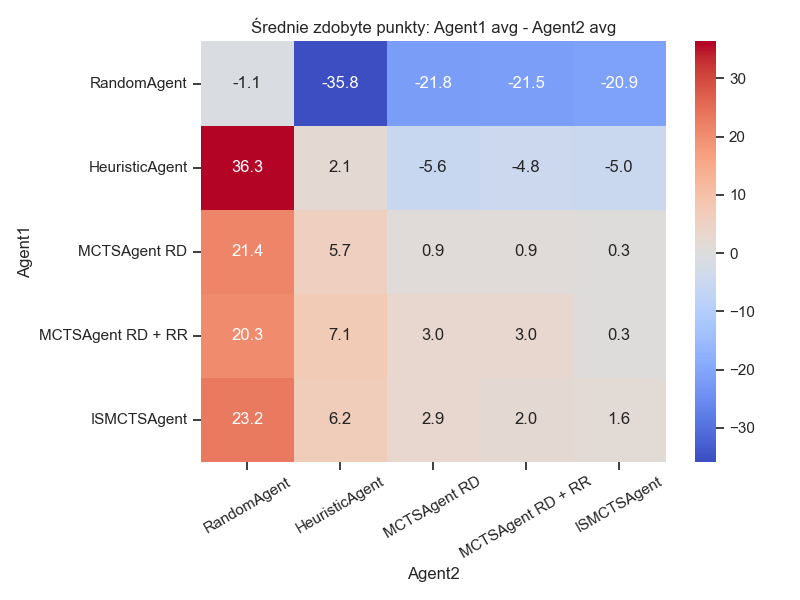
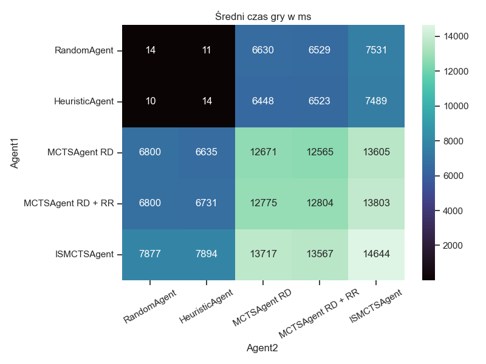

# 7 Wonders

This repository contains several related .NET projects, simulation and agent-training tools, and analysis materials for the game 7 Wonders. The main parts are separated by responsibility: domain model, AI logic, simulation execution, tests, result analysis, and architecture documentation.

## Repository Structure

```text
7 Wonders/
├── GameCore/              # Core domain logic of the game
├── GameAI/                # Agents, state encoding, and AI integration
├── GameConsole/           # Console application for running matches and experiments
├── GameTests/             # Unit tests and verification scenarios
├── Unity/                 # Unity project / engine integration
├── analysis/              # Scripts, notebooks, and result analysis reports
├── architecture_models/   # Architecture diagrams in PlantUML
└── requirements.txt       # Python dependencies for analysis scripts
```

## Projects and Their Roles

### `GameCore`
The game domain layer. It contains the core entities and gameplay mechanics: players, boards, cards, progress tokens, game state, and move execution logic. This is where the central model describing what happens during a match lives.


### `GameAI`
The layer responsible for agent decision-making. It contains different strategies, decision resolvers, numerical state encoding, and integrations used in ML and self-play experiments.

Implemented agents include:
- `RandomAgent` — baseline agent that chooses actions randomly.
- `HeuristicAgent` — rule-based agent using handcrafted heuristics.
- `MCTSAgent` — Monte Carlo Tree Search-based agent.
- `ISMCTSAgent` — informed variant of MCTS with additional guidance.

### `GameConsole`
A command-line application. It is used to run matches, test agents, launch tournament simulations, and collect result data without needing to open Unity.


### `GameTests`
A set of tests for the most important game and agent logic. It is a good place to check rules, regressions, and domain model behavior after changes.

### `Unity`
A Unity integration project for playable application (still in development). It contains the Unity scene, prefabs, and scripts for rendering the game and running matches with AI agents.

### `analysis`
Tools for processing experiment results. This directory contains notebooks, report aggregation scripts, data conversion scripts, and ready-made result and chart files.

Below are example plots generated from the simulation results *(**row** means the agent in the **first player** position, and **column** means the agent in the **second player** position)*:

- `RandomAgent` — baseline random agent.
- `HeuristicAgent` — heuristic agent with parameters optimized by a genetic algorithm.
- `MCTSAgent RD` — MCTS agent with root determinization.
- `MCTSAgent RD + RR` — hybrid MCTS agent combining root determinization with reshuffling cards in each rollout.
- `ISMCTSAgent` — agent based on the Information Set MCTS algorithm.


### Win rate heatmap for different agent pairings


### Average points gap heatmap for different agent pairings


### Average game time heatmap for different agent pairings


## Supporting Files

- `requirements.txt` contains the dependencies needed by the Python scripts in `analysis`.
- `7 Wonders.sln` and the other `.sln` and `.csproj` files let you open selected parts of the solution separately.